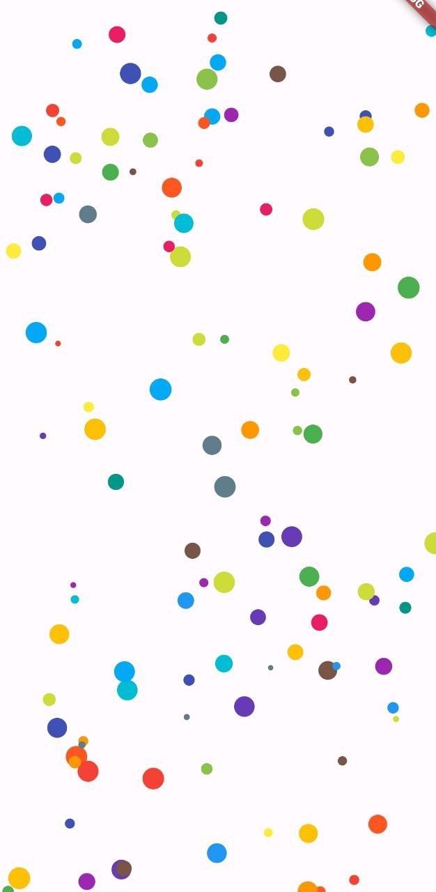

# Generador de Partículas en Flutter

## Descripción

Este proyecto es una prueba de concepto que demuestra cómo utilizar el widget `CustomPainter` de Flutter para crear un `Canvas` que muestre una serie de partículas de distintos colores y tamaños de forma dinámica. Las partículas se mueven de manera aleatoria por la pantalla, creando un efecto visual llamativo. Este ejemplo puede servir como base para proyectos más complejos que requieran animaciones personalizadas o la manipulación de gráficos a bajo nivel en Flutter.



## Características

- Uso de `CustomPainter` para dibujar partículas en un canvas.
- Controlador de partículas para manejar la lógica de movimiento.
- Interacción con el usuario para añadir partículas en el lugar en que el usuario pulsa.

## Tecnologías Utilizadas

- [Flutter](https://flutter.dev/): SDK de UI para crear aplicaciones natively compiladas.
- [Dart](https://dart.dev/): Lenguaje de programación utilizado por Flutter.

## Cómo Empezar

Para ejecutar este proyecto, necesitas tener Flutter instalado en tu sistema. Si aún no lo has hecho, puedes seguir las instrucciones de instalación en el [sitio web oficial de Flutter](https://flutter.dev/docs/get-started/install).

### Pasos para Ejecutar el Proyecto

1. Clona este repositorio en tu máquina local:

```bash
  git clone https://codeberg.org/betazetadev/particle-painter.git
```

2. Abre un terminal y navega al directorio del proyecto:

```bash
  cd particle-painter
```

3. Descarga las dependencias del proyecto:

```bash
  flutter pub get
```

4. Ejecuta el proyecto en un emulador o dispositivo físico:

```bash
  flutter run
```

## Licencia

Este proyecto está licenciado bajo [MIT License](https://opensource.org/licenses/MIT).
